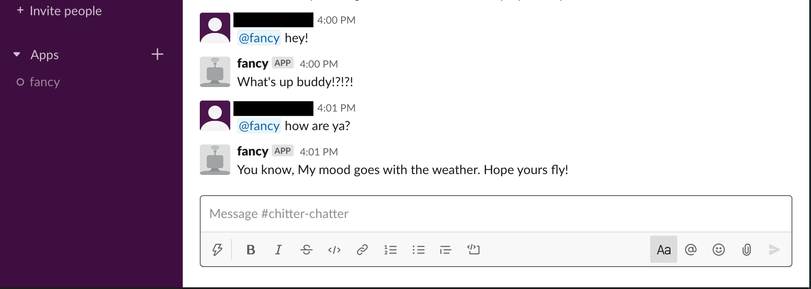

# FancyBot

## About this project
This project creates a bot for Slack using Slack and Real Time Messaging (RTM) API. FancyBot is the name of the bot because it likes to be fancy. 

FancyBot responds in real time to users when they ask various things. Responses depend on what was asked. Try being awful and it will not like you!

The project is written in Go. Original project idea from [Slack-Bot](https://rsmitty.github.io/Slack-Bot/)

## What you will need
You'll need a Slack workspace to play around with. You'll also need to create a Slack Bot in your [workspace](https://slack.com/intl/en-au/help/articles/115005265703-Create-a-bot-for-your-workspace#add-a-bot-user). Remember the token created for your Slack Bot. Keep it somewhere safe! You'll need to use it later.

## How it works
- Clone this repository
- Export your slack token to your local environment by running 
  `export SLACK_TOKEN="your-token-here"`
- Start the bot by running `go run fancy`. This will start connecting to Slack which prints a series of events locally!
- In another window, open the Slack chat and test the bot by typing `@fancy hey!` in the Slack window 
- If it responds with something, hey it works!

## To Do
- This project needs tests which will be added later!
- Various responses need to be added and vary depending on user input. We need to make FancyBot fancy, not *dumb*!
