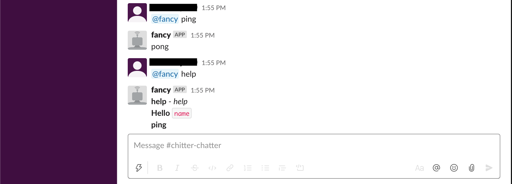

# FancyBot



## About this project
This project creates a bot for Slack using Slacker API. FancyBot is the name of the bot because it likes to be fancy. 

FancyBot responds in real time to users when they ask various things. Responses depend on what was asked. Try the following:

```
@fancy hello!
@fancy hello Susan!
@fancy ping
@fancy repeat awesome 3 
```

The project writes in Go. Original project idea from [Slacker](https://github.com/shomali11/slacker)

## What you will need
If you would like to speak to FancyBot, you'll need access to my [Slack workspace](https://app.slack.com/client/T016S4JHR1C/C016Z89ESM9/thread/C016Z89ESM9-1599020105.007200) You will also require the Slack token to access FancyBot.


## How it works
- Obtain the Slack token for this bot
- Export your slack token to your local environment by running 
  `export SLACK_TOKEN="your-token-here"`
- Start the bot by running `go run src/main.go`. This will connect to Slack API and allow FancyBot to access the chat.
- In another window, open the Slack chat and test the bot by typing `@fancy hello!` in the Slack window 
- If it responds with something, hey you are officially speaking with FancyBot!

## Other cool things
This project is now available in Docker! For more information on migrating this project to a Docker container, refer to [DOCKER.md](DOCKER.md)

## To Do
This project needs tests
